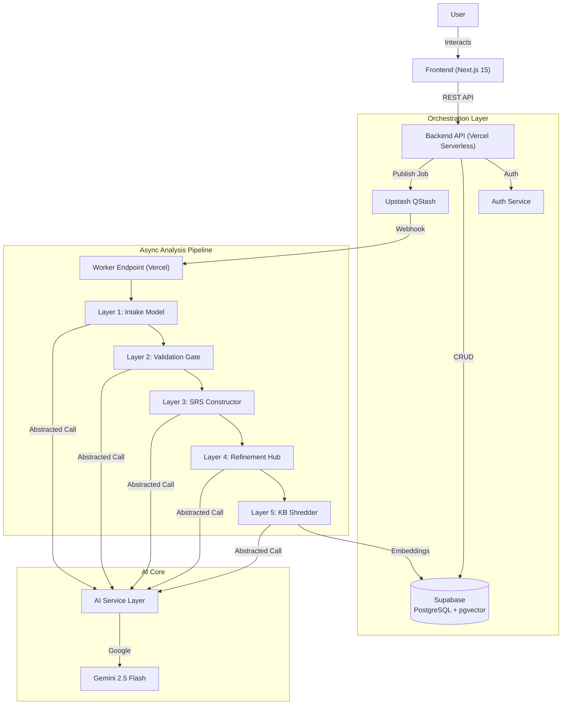
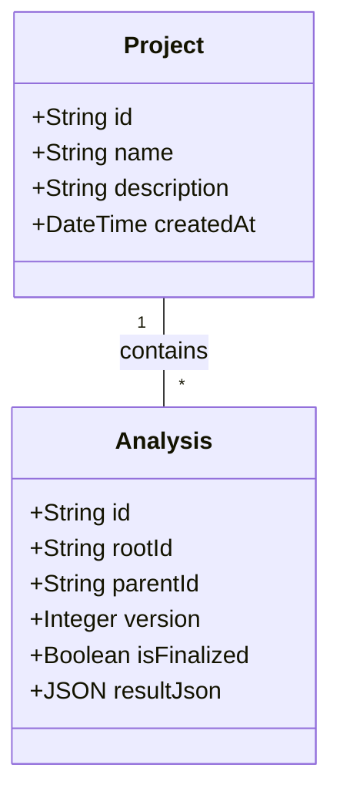

# System Architecture

## Overview

The SRA (Smart Requirements Analyst) system is a modern, event-driven ecosystem designed as a highly decoupled multi-layer pipeline. It follows a **Pipeline-as-a-Service** pattern where each layer adds increasing levels of fidelity and verification to the requirements.

## The 5-Layer Analysis Strategy

SRA moves beyond simple "prompt-and-result" patterns by treating requirement generation as a multi-step manufacturing process.

### Layer 1: Structured Intake
Converts raw, unstructured user intent into a **Standard Intake Model**. This ensures that even the most chaotic descriptions are mapped to the correct IEEE sections early in the process.

### Layer 2: Validation Gatekeeper
A critical "Quality Gate" that analyzes the Layer 1 output for ambiguity, missing context, or internal contradictions. 
- **PASS**: Proceeds to full generation.
- **FAIL**: Returns to user with specific "Clarity Requests".

### Layer 3: Final Analysis (IEEE SRS)
This layer consumes the validated intake model to generate the "Source of Truth" SRS. It synthesizes user stories, functional specs, and visual Mermaid.js models.

### Layer 4: Refinement Cycle (Chat & Patch)
Enables iterative human-in-the-loop improvements. Users talk to the AI to "nudge" specific requirements, and the system performs a non-destructive patch to the existing model, creating a new version.

### Layer 5: Knowledge Base Reuse
Finalized SRS modules are shredded into semantic chunks and stored in the **Knowledge Base**. Identical or sufficiently similar future requests are served directly from this pre-validated cache, ensuring sub-second response times.

## Versioning & Data Tree

SRA uses a **Branching Version Tree** to manage the evolution of projects.

### Entity Relationship
- **Analysis**: Each version is a standalone record linked via `rootId` and `parentId`.
- **Project**: A top-level container that tracks user ownership and metadata.

## AI Service Tier
The system implements a **Provider Abstraction** pattern. This allows the same logic (e.g., Layer 3 generation) to run on different LLMs (Gemini, GPT-4, etc.) without code changes, simply by toggling a setting in the `Analysis` metadata.
