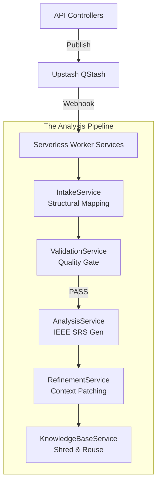

# SRA Backend: 5-Layer Analysis Engine


The SRA Backend is a high-performance Express.js ecosystem powered by Google Gemini, designed to orchestrate the transition from raw project intent to validated IEEE-830 requirements.

## 🏗️ 5-Layer Service Architecture

Our core logic is partitioned into five distinct service layers for maximum reliability and scalability.



### 1. **IntakeService** (Structural Mapping)
Translates unstructured text into the `SRSIntakeModel`. This ensures that even early-stage inputs occupy a structured schema before complex AI analysis begins.

### 2. **ValidationService** (The Gatekeeper)
Runs a dedicated "Quality Audit" on the Intake model. It scores requirements for ambiguity and completeness. Only high-confidence models proceed to Layer 3.

### 3. **AnalysisService** (IEEE Construction)
The heavy-lifter. Consumes validated intake data to generate a complete SRS including user stories, acceptance criteria, and Mermaid diagrams.

### 4. **RefinementService** (Context Patching)
Handles iterative improvements via chat. It uses a "context-injection" strategy to inform the AI of existing project state while applying new user directives.

### 5. **KnowledgeBaseService** (KB Shredder)
Shreds finalized analyses into semantic chunks. Implements the "Hash-and-Match" strategy for Layer 5 reuse, enabling sub-second response times for identical project descriptions.

## 🛠️ Performance & Reliability

### Background Processing
-   **Upstash QStash**: Serverless async messaging for scalable AI operations.
-   **Atomic Responses**: Users receive immediate "Analysis Started" responses, with progress updates delivered via subsequent polling.

### AI Robustness
-   **Dynamic Provider Switching**: Abstraction layer supports Gemini 2.5 and OpenAI GPT-4o.
-   **Error Backoff**: Automated exponential backoff for 429 (Rate Limit) and 5xx (AI Downtime) errors.

## 🚀 Setup & Deployment

### Prerequisites
-   Node.js (v18+) & npm
-   PostgreSQL (Database)
-   Upstash QStash (Serverless Queue)
-   Gemini API Key

### Installation

1.  **Install Dependencies**:
    ```bash
    npm install
    ```

2.  **Environment Configuration**:
    Configure `.env` (see root README for template).

3.  **Database Migration**:
    ```bash
    npx prisma migrate dev
    ```

4.  **Start Server**:
    ```bash
    npm run dev
    ```

## 🔗 Key API Domains

| Domain | Controller | Description |
| :--- | :--- | :--- |
| **Auth** | `authController` | JWT, Google/GitHub OAuth, Session Mgmt |
| **Analysis** | `analysisController` | Layer 1-3 creation and Layer 4 refinements |
| **Knowledge** | `knowledgeController` | Layer 5 finalization and reuse queries |

## 🧪 Integration Testing

We maintain high coverage of the analysis layers via specialized integration scripts:

-   `test-layer1-integration.js`: Verifies intake structured mapping.
-   `test-validation-integration.js`: Benchmarks the AI gatekeeper accuracy.
-   `test-layer5-integration.js`: Confirms Knowledge Base shredding and hash-reuse consistency.
